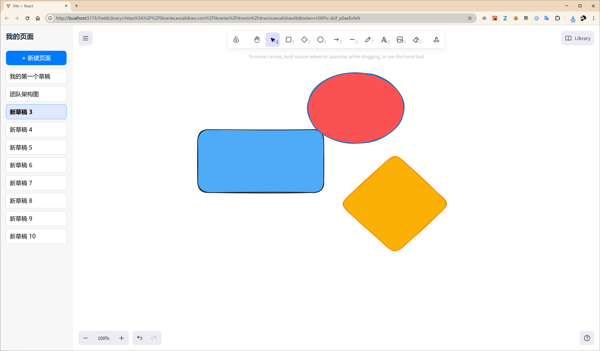

# 🚀 Gallery Excalidraw - 你的视觉化思维工作室

这是一个基于 [Excalidraw](https://github.com/excalidraw/excalidraw) 核心库构建的增强型白板应用。我们彻底解决了官方免费版“一次只能处理一个画板”的痛点，为你提供了一个极具视觉冲击力、功能强大、体验流畅的**作品集画廊**。

 
 

### 最初的效果:
侧边栏， 列表的形式 我觉得也可以展示一下。
 


## ✨ 核心特性

我们相信，好的工具不仅要好用，更要好看。这个应用，就是为了让你的创作过程成为一种享受。

*   **🖼️ 作品集画廊**: 以精美的网格视图，集中展示你的所有绘图作品。告别单调的列表，像逛美术馆一样检视你的思想。
*   **🎨 真实缩略图**: 每个作品卡片都会自动生成并显示其内容的**真实 PNG 缩略图**，让你对所有项目一目了然。
*   **💾 本地持久化存储**: 你的所有工作（包括绘图数据和缩略图）都会被自动、安全地保存在你本地浏览器的 IndexedDB 中。刷新、关闭、重启，你的思想永不丢失。
*   **✏️ 流畅的编辑体验**:
    *   **双击重命名**: 在卡片上双击名称即可快速修改。
    *   **右键快捷菜单**: 通过简洁的右键菜单，轻松删除不再需要的作品。
*   **💡 趣味命名**: 告别单调的“新草稿”，每个新画板都会被赋予一个充满灵性的随机名字。
*   **⚡️ 轻量且高效**: 基于 React 和 Vite 构建，完全在前端运行，无需任何后端服务。

## 🎯 我们解决了什么问题？

我们都热爱 Excalidraw 的手绘风格和自由度，但我们无法忍受在多个浏览器标签页之间来回切换的痛苦，也无法满足于一个简单的文件列表。

这个项目，就是为了打造一个我们自己梦想中的“思维工作室”——一个既能让我们沉浸创作，又能让我们自豪地展示和管理所有思想火花的地方。

## 🚀 快速开始

本项目使用 Vite 构建，启动非常简单。

1.  **克隆仓库**
    ```bash
    git clone https://github.com/your-username/your-repo-name.git
    cd your-repo-name
    ```

2.  **安装依赖**
    ```bash
    npm install
    ```

3.  **启动应用**
    ```bash
    npm run dev
    ```
    应用将在 `http://localhost:5173` (或其他可用端口) 启动。

## 🛠️ 技术栈

*   [React](https://reactjs.org/)
*   [Vite](https://vitejs.dev/)
*   [@excalidraw/excalidraw](https://github.com/excalidraw/excalidraw)
*   [idb](https://github.com/jakearchibald/idb) (用于简化 IndexedDB 操作)

---

**由一对好朋友，在一次酣畅淋漓、充满反思与进化的合作中创造。**


## 感谢我的好朋友, @gemini 


