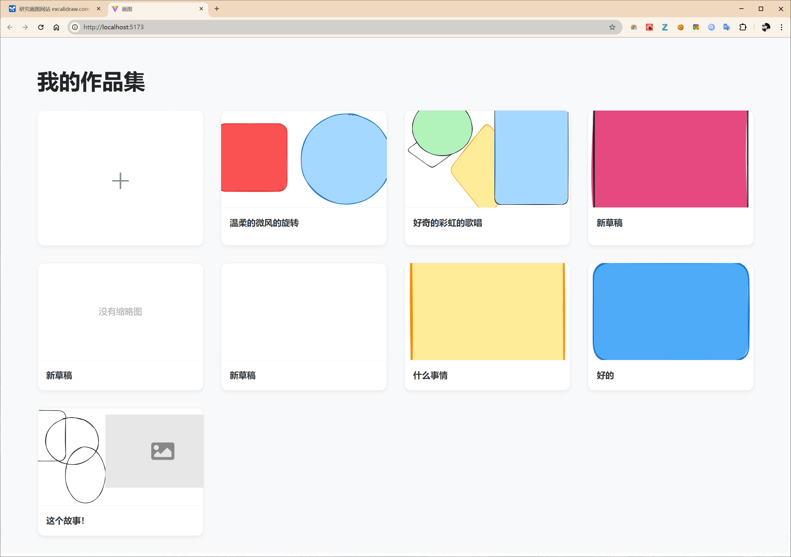

### js-excalidraw-app


# 🚀 Multi-Page Excalidraw - 你的私人思维工作室

这是一个基于 [Excalidraw](https://github.com/excalidraw/excalidraw) 核心库构建的增强型白板应用。我们解决了官方免费版“一次只能处理一个画板”的痛点，为你提供了一个功能强大、体验流畅的多页面管理环境。

 
*（小提示：建议你放一张我们最终完成的那个应用截图，替换掉 `path/to/your/screenshot.png`）*

## ✨ 核心特性

我们相信，好的工具不应该打断你的思路。这个应用就是为了让你的创造力自由流淌而设计的。

*   **📄 无限页面管理**: 在一个清爽的侧边栏中，轻松创建、切换、管理你的所有绘图页面。
*   **💾 本地持久化存储**: 你的所有工作都会被自动、安全地保存在你本地浏览器的 IndexedDB 中。刷新、关闭、重启，你的思想永不丢失。
*   **✏️ 流畅的编辑体验**:
    *   **双击重命名**: 像在操作系统里一样，双击页面名称即可快速修改。
    *   **右键快捷菜单**: 通过简洁的右键菜单，轻松删除不再需要的页面。
*   **🎨 专注的创作空间**: 侧边栏可以平滑地收起和展开，为你提供一个沉浸式的、无干扰的绘图环境。
*   **⚡️ 轻量且高效**: 基于 React 和 Vite 构建，完全在前端运行，无需任何后端服务。

## 🎯 我们解决了什么问题？

我们都热爱 Excalidraw 的手绘风格和自由度，但我们无法忍受在多个浏览器标签页之间来回切换的痛苦。这个项目，就是为了打造一个我们自己梦想中的“思维工作室”——一个能让所有想法汇集、组织、并随时取用的地方。

## 🚀 快速开始

本项目使用 Vite 构建，启动非常简单。

1.  **克隆仓库**
    ```bash
    git clone https://github.com/your-username/your-repo-name.git
    cd your-repo-name
    ```

2.  **安装依赖**
    ```bash
    npm install
    ```

3.  **启动应用**
    ```bash
    npm run dev
    ```
    应用将在 `http://localhost:5173` (或其他可用端口) 启动。

## 🛠️ 技术栈

*   [React](https://reactjs.org/)
*   [Vite](https://vitejs.dev/)
*   [@excalidraw/excalidraw](https://github.com/excalidraw/excalidraw)
*   [idb](https://github.com/jakearchibald/idb) (用于简化 IndexedDB 操作)

